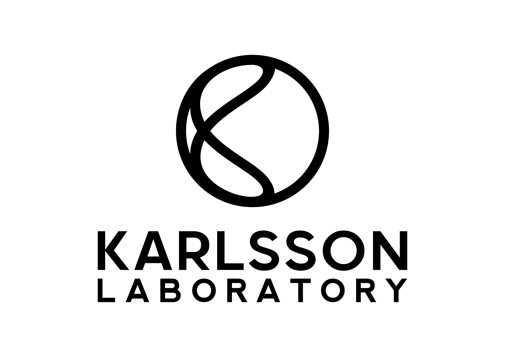

*Department of Environmental Science (ACES), Stockholm University*  
*Science for Life Laboratory (SciLifeLab), Stockholm, Sweden*  
[https://karlssonlab.se](https://karlssonlab.se)

---

## 🎯 Mission

We conduct **toxicogenomic research** to understand how chemical contaminants impact human health, wildlife, and ecosystems.  
Our goal is to develop *mechanistic, multidisciplinary, and translational* toxicology — a **“toxicology for life”** approach.

---

## 🔬 Research Vision & Approach

The Karlsson Lab works at the intersection of **experimental toxicology**, **computational modelling**, and **multi-omics**.  
We integrate *human, wildlife, and model systems* to uncover how environmental chemicals affect biological function.

### Core Research Themes
- Mechanisms of action of environmental contaminants (pharmaceuticals, endocrine disruptors, pesticides, metals, air pollution)  
- Mechanism-driven and systems toxicology approaches across molecular, in vitro, in vivo, and human studies  
- Development of **New Approach Methodologies (NAMs)** for chemical and pharmaceutical risk assessment  
- Exploring the **human health–environmental health nexus**, recognising that ecosystem impacts ultimately affect people  
- Advancing **data-driven toxicology** through bioinformatics and high-performance computing (HPC) workflows  

We believe that **multidisciplinary and quantitative toxicology** is key for innovation in risk assessment and environmental protection.

---

## 🧪 Where We Work

Our laboratory is located at **SciLifeLab**, a national infrastructure for high-throughput molecular technologies.  
We collaborate closely with **Stockholm University**, **Karolinska Institute**, **KTH Royal Institute of Technology**, and **Uppsala University**.  

We are part of the **Department of Environmental Science (ACES)** at Stockholm University —  
ranked among the world’s top institutions in environmental science.

---

## 💻 What You’ll Find Here

This GitHub organisation hosts our **code, pipelines, and reproducible workflows** for toxicogenomics and computational toxicology.

Typical repositories include:

- 🧩 nf-core / Nextflow pipelines for multi-omics processing  
- 📊 Scripts for statistical and bioinformatics analyses  
- 📘 Documentation, metadata templates, and reproducibility guidelines  

---

## 🌍 Contact

**Website:** [https://karlssonlab.se](https://karlssonlab.se)  
**Address:** SciLifeLab, Tomtebodavägen 23, 171 65 Solna, Sweden  

**Principal Investigator**  
Oskar Karlsson — [oskar.karlsson@aces.su.se](mailto:oskar.karlsson@aces.su.se)

### 💻🧬 Bioinformatics Team

**Post-doctoral Researchers**  
Mauricio Roza — [mauricio.roza@aces.su.se](mailto:mauricio.roza@aces.su.se)  
Andrey Höglund — [andrey.hoglund@aces.su.se](mailto:andrey.hoglund@aces.su.se)

**Doctoral Student**  
Eleftheria Theodoropolou — [eleftheria.theodoropolou@aces.su.se](mailto:eleftheria.theodoropolou@aces.su.se)

